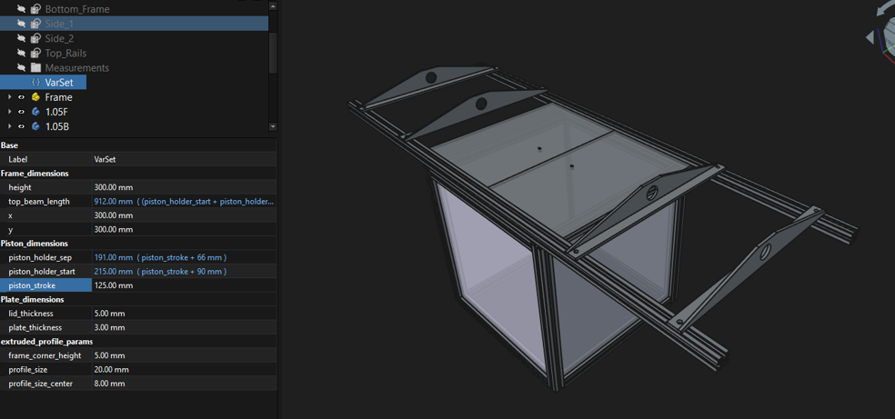
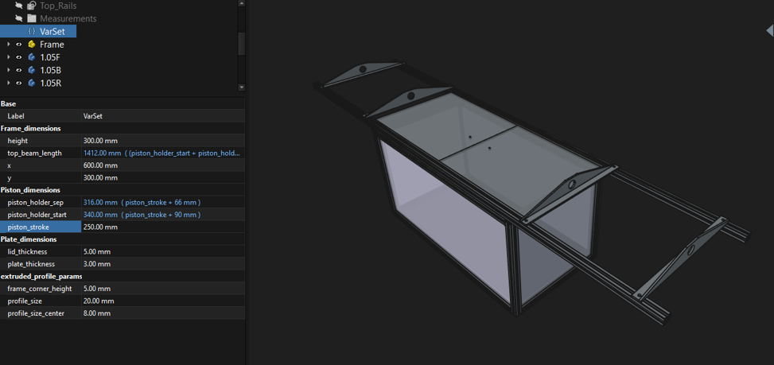
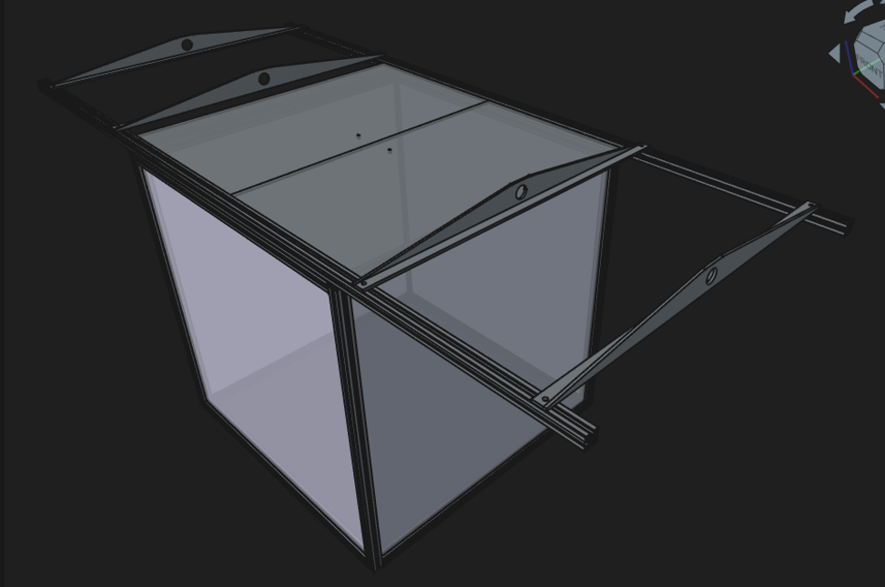

## WARNING WORK IN PROGRESS NOT YET TESTED! 
Dont use theese designfiles as they are still untested, use Mastepanovs design if you want a tested design. 

# Parametric Autochamber
Parametric Autochamber design based on [Mikhail Mastepanov](https://www.sciencedirect.com/science/article/pii/S2468067226000428)s original design, but designed for the Misumi HFS5-2020 extrusion and parts

Designed in Freecad 1.1.3 with the EasyProfileFrame plugin.

The chamber is specified using the centerlines of the inner cube and all component parts are dynamically made from those parameters.

The most important variables are x,y,height and piston length

Some examples of what you can do with it:

300x300x300mm 125mm piston:

600x300x300 250mm piston:

585x585x580mm 250mm

## Changing the design

You dont need any plugins to run this, but if you want design another frame profile or get the automatic frame BOM you need to install the [EasyProfileFrame plugin](https://github.com/ovo-Tim/EasyProfileFrame). and rerun the Frame design with your own profile sketch. 

Dimension parameters for the Frame itself:

| Parameter | Current value | Comment |
|---|---:|---|
| `x` | 585 mm | x dimension centerline |
| `y` | 585 mm | y dimension centerline |
| `height` | 580 mm | centerline height of the lower cube, final chamber hight is one profile height higher |
| `piston_stroke` | 250 mm | The pneumatic sylinder CD85N20-###C-B comes in multiple piston lengths, the standard ones are: 10, 25, 40, 50, 80, 100, 125, 160, 200, 250 and 300mm So you should choose one of those so you dont need custom ones made. |
| `plate_thickness` | 3 mm | Wallplate Thickness |
| `lid_thickness` | 5 mm | Roof plate thickness |

Parameters for the alu extrusion profile

| Parameter | Current value | Comment |
|---|---:|---|
| `frame_corner_height` | 5 mm | The height of the corner brackets |
| `profile_size` | 20 mm | 2020 profile = 20mm |
| `profile_size_center` | 8 mm | Thw width of the center hub in the profile |

Automatically calculated parameters:

| Parameter | Current value | Expression |
|---|---:|---|
| `piston_holder_sep` | 316 mm | `piston_stroke + 66 mm` |
| `piston_holder_start` | 340 mm | `piston_stroke + 90 mm` |
| `top_beam_length` | 1412 mm | `(piston_holder_start + piston_holder_sep + 50 mm) * 2` |

Change the independent parameters in `VarSet`; the calculated parameters update automatically.
